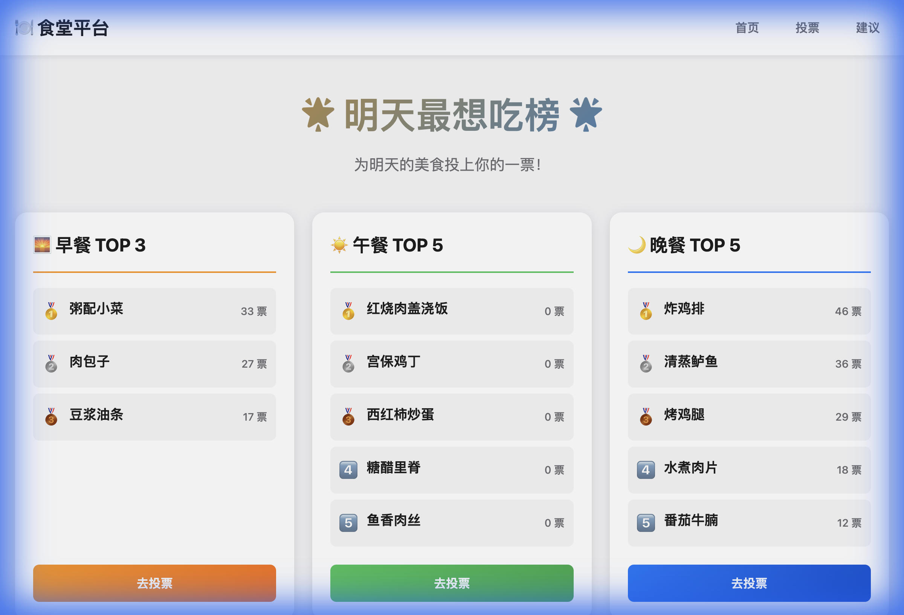

# 🍽️ 食堂意见建议平台 (Canteen Feedback System)


一个基于 Django 构建的现代化食堂反馈与投票平台。旨在收集师生意见，并通过实时排行榜展示热门餐饮需求。


*(注意：请确保 docs/images 目录下有预览图，或者此处留空等待添加)*

## ✨ 核心功能

*   **🏆 明天最想吃榜**: 实时更新的早餐、午餐、晚餐投票排行榜。
*   **🗳️ 实时投票**: 支持按餐点分类投票，内置 IP 防刷机制。
*   **☁️ 舆情词云**: 基于 jieba 分词，从建议中提取高频关键词动态展示。
*   **📱 响应式设计**: 完美适配桌面端与移动端访问。
*   **🛡️ 安全可靠**: 完整的 CSRF 保护与输入验证。
*   **⚙️ 后台管理**: 强大的 Django Admin 后台，便于数据管理与审核。

## 📚 文档索引

为了帮助你更好地理解和使用本项目，我们准备了详细的文档：

| 文档                                        | 说明                                      |
| :------------------------------------------ | :---------------------------------------- |
| **[快速启动](README.md#🚀-快速启动)**        | 下方的快速安装与运行指南                  |
| **[架构设计](docs/ARCHITECTURE.md)**        | 系统架构图、数据库ER图与设计决策          |
| **[API 文档](docs/API.md)**                 | 详细的后端接口定义与请求示例              |
| **[部署指南](docs/DEPLOYMENT.md)**          | Nginx/Gunicorn 生产环境部署与 Docker 指导 |
| **[测试指南](docs/TESTING.md)**             | 自动化测试运行与手动验收清单              |
| **[实施方案](docs/IMPLEMENTATION_PLAN.md)** | 详细的技术实施方案与设计文档              |
| **[演示文档](docs/WALKTHROUGH.md)**         | 功能演示与验证结果                        |
| **[贡献指南](CONTRIBUTING.md)**             | 代码规范与协作流程                        |
| **[变更日志](CHANGELOG.md)**                | 版本更新历史                              |

## 🚀 快速启动

### 1. 环境准备
确保已安装 Python 3.10+ 和 Git。

### 2. 安装运行

```bash
# 克隆仓库
git clone https://github.com/your-username/case-gallery.git
cd case-gallery

# 创建并激活虚拟环境
python3 -m venv venv
source venv/bin/activate  # Windows: venv\Scripts\activate

# 安装依赖
pip install -r requirements.txt

# 初始化数据库
python manage.py migrate

# 创建超级管理员
python manage.py createsuperuser

# 导入示例数据 (可选)
python add_sample_data.py

# 启动开发服务器
python manage.py runserver
```

访问 http://127.0.0.1:8000 即可看到系统首页。
访问 http://127.0.0.1:8000/admin 进入后台管理。

## 🧪 运行测试

```bash
python manage.py test
```

## 🤝 贡献代码

欢迎提交 Issue 或 Pull Request！请参考 [贡献指南](CONTRIBUTING.md)。

## 📄 许可证

本项目基于 MIT 许可证开源。
