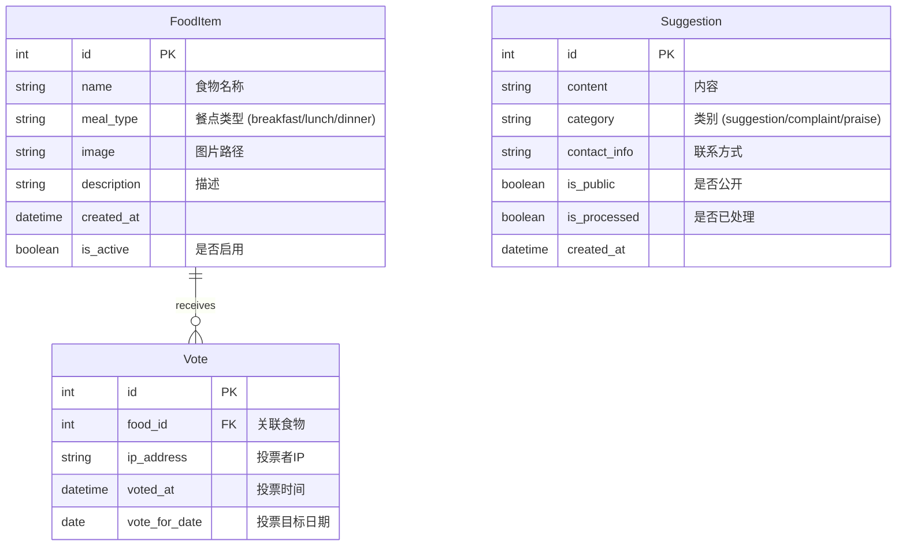

# 系统架构与设计文档

## 1. 系统概述

本系统是一个基于 Django 的食堂投诉与建议平台，旨在收集用户的餐饮反馈，并通过实时排行榜和词云展示当前的热门餐点和舆情焦点。系统设计注重响应速度、移动端适配以及数据实时性。

### 1.1 技术栈

| 组件         | 技术选型                | 版本  | 说明                                                    |
| :----------- | :---------------------- | :---- | :------------------------------------------------------ |
| **Web 框架** | Django                  | 6.0+  | 高效、安全的 Python Web 框架                            |
| **数据库**   | SQLite3                 | -     | 开发与轻量级部署，生产环境可平滑迁移至 PostgreSQL/MySQL |
| **前端**     | HTML5, CSS3, Vanilla JS | -     | 无需构建工具的轻量级前端实现，CSS 变量实现主题化        |
| **中文分词** | Jieba                   | 0.42+ | 用于从建议文本中提取关键词生成词云                      |
| **图片处理** | Pillow                  | 10.0+ | 处理上传的食物图片                                      |

---

## 2. 系统架构

系统采用经典的 MTV (Model-Template-View) 架构模式。

```mermaid
graph TD
    User[用户 (Browser/Mobile)] -->|HTTP Request| Nginx[Web Server (Nginx)]
    Nginx -->|Proxy| Gunicorn[WSGI Server (Gunicorn)]
    Gunicorn -->|WSGI| Django[Django Application]
    
    subgraph Django App
        URL[URL Dispatcher] --> View[Views (Logic)]
        View -->|Query| Model[Models (ORM)]
        View -->|Render| Template[Templates (HTML)]
        Model --> DB[(Database)]
    end
    
    View -->|JSON| User
    Template -->|HTML| User
```

### 2.1 核心模块划分

*   **Core App (`core`)**: 承载所有业务逻辑。
    *   `models.py`: 定义数据结构。
    *   `views.py`: 处理页面渲染和 API 请求。
    *   `admin.py`: 定制化后台管理界面。
    *   `urls.py`: 应用内部路由。

---

## 3. 数据库设计

系统包含三个核心实体：食物项目 (FoodItem)、投票记录 (Vote) 和意见建议 (Suggestion)。

### 3.1 ER 图



### 3.2 关键设计决策

1.  **投票防刷机制**:
    *   在 `Vote` 模型中使用 `unique_together = [['food', 'ip_address', 'vote_for_date']]` 联合唯一索引。
    *   这确保了同一个 IP 地址在针对同一天的同一个食物只能投一票，有效防止简单的刷票行为。

2.  **词云生成策略**:
    *   词云数据并非实时从全量数据计算（如果数据量巨大），而是通过 API 实时查询最近 30 天的**公开**建议。
    *   使用 `jieba.analyse.extract_tags` 提取高权重关键词，过滤掉无意义的虚词。

3.  **时区处理**:
    *   项目配置为 `Asia/Shanghai` 时区。
    *   投票的 `vote_for_date` 逻辑默认为“明天”，即 `timezone.now() + timedelta(days=1)`，符合“明天最想吃”的业务场景。

---

## 4. 目录结构说明

```bash
case-gallery/
├── config/                  # 项目配置目录 (Settings, URLConf, WSGI)
├── core/                    # 核心应用目录
│   ├── migrations/          # 数据库迁移文件
│   ├── static/              # 应用级静态文件 (CSS, JS)
│   ├── templates/           # 应用级 HTML 模板
│   ├── admin.py             # 后台管理配置
│   ├── models.py            # 数据模型定义
│   ├── views.py             # 视图函数与 API 接口
│   └── ...
├── media/                   # 用户上传文件存储目录 (如食物图片)
├── venv/                    # Python 虚拟环境
├── add_sample_data.py       # 数据填充脚本
├── manage.py                # Django 管理命令行工具
└── requirements.txt         # 项目依赖列表
```

## 5. 业务流程

### 5.1 投票流程
1.  用户访问 `/vote/` 页面。
2.  前端通过 JS 获取 CSRF Token。
3.  用户点击“投票”按钮。
4.  发送 POST 请求至 `/api/vote/`。
5.  后端验证：
    *   检查食物是否存在且活跃。
    *   检查 IP 是否已在今日针对该食物投过票。
6.  后端写入 `Vote` 记录或返回错误信息。
7.  前端显示 Toast 提示结果。

### 5.2 榜单更新流程
1.  前端首页加载。
2.  JS 发起 GET 请求至 `/api/rankings/`。
3.  后端聚合查询：
    *   筛选 `vote_for_date` 为明天的投票。
    *   按餐点类型分组，统计票数 (`Count` 聚合)。
    *   按票数倒序排列，取 Top N。
4.  返回 JSON 数据。
5.  前端渲染 DOM。
6.  前端每 30 秒轮询一次，保持数据实时性。
