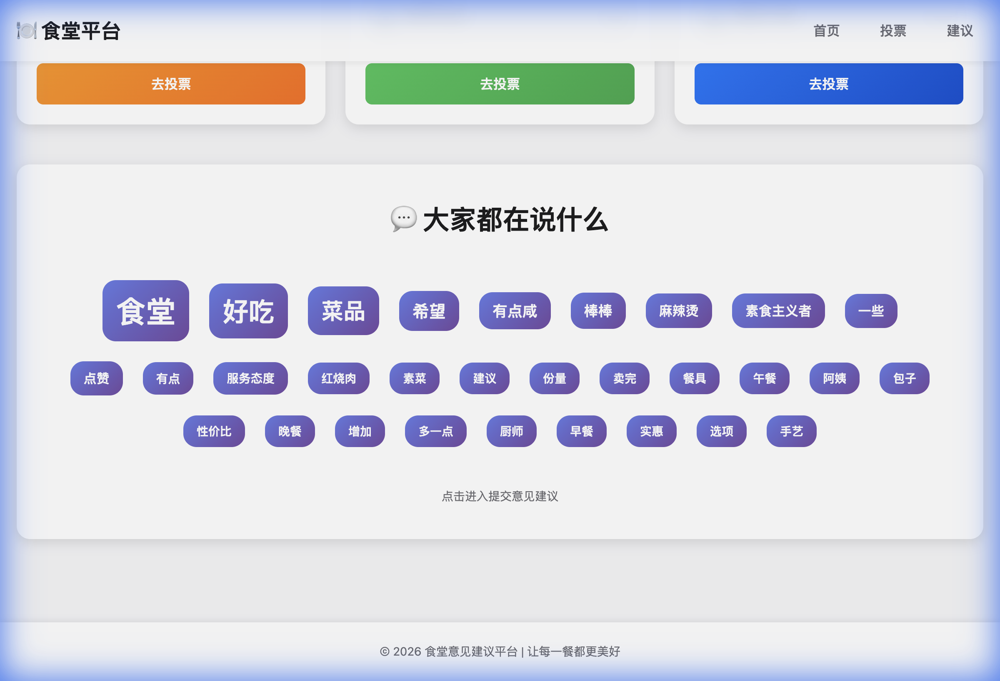
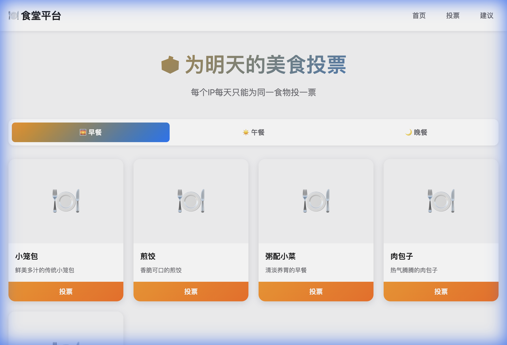
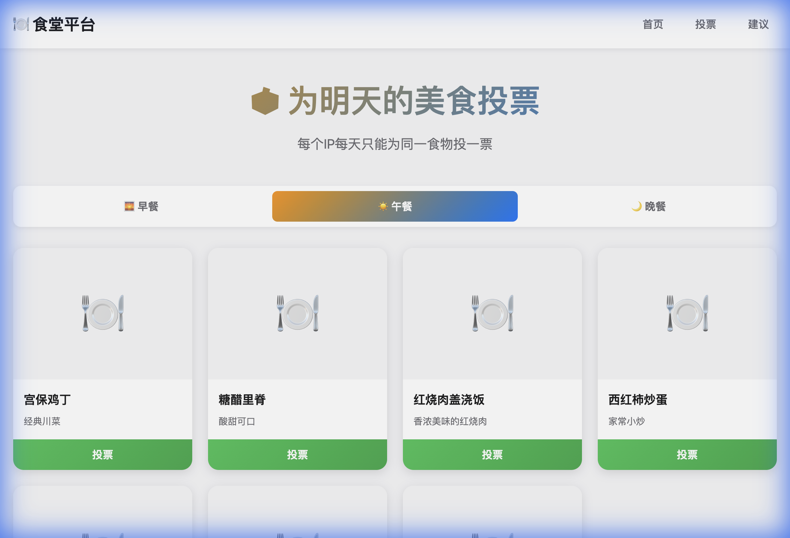
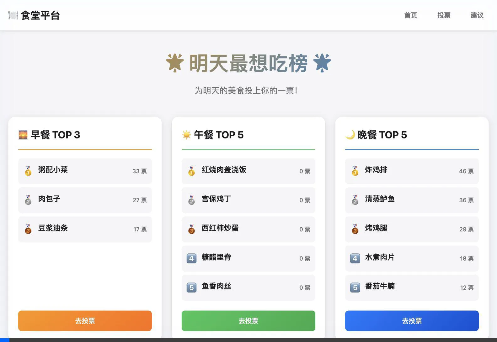

# 食堂意见建议平台 - 项目演示

本文档展示了完整的食堂投诉和建议网站的实现过程和最终成果。

---

## 项目概述

成功创建了一个基于 Django 的食堂意见建议平台，包含以下核心功能：

1. **明天最想吃榜** - 实时更新的食物投票排行榜（早餐TOP3、午餐TOP5、晚餐TOP5）
2. **投票系统** - 用户可为明天的食物投票，每个IP每天限投一票
3. **意见建议** - 用户可提交投诉、建议或表扬
4. **词云展示** - 基于 jieba 中文分词的关键词提取和展示
5. **后台管理** - Django Admin 完整配置

---

## 技术架构

### 后端技术栈
- **框架**: Django 6.0.1
- **数据库**: SQLite3
- **Python 版本**: Python 3.14
- **关键依赖**: 
  - Pillow 12.1.0 (图片处理)
  - jieba 0.42.1 (中文分词)

### 前端技术栈
- **HTML5** + **CSS3** + **Vanilla JavaScript**
- 现代化设计系统（CSS变量、渐变色、动画）
- 响应式布局（Grid + Flexbox）
- AJAX 异步交互

---

## 数据库模型

### FoodItem（食物项目）
```python
- name: 食物名称
- meal_type: 餐点类型（breakfast/lunch/dinner）
- image: 食物图片（可选）
- description: 描述
- is_active: 是否启用
```

### Vote（投票记录）
```python
- food: 关联食物（外键）
- ip_address: 投票者IP
- voted_at: 投票时间
- vote_for_date: 投票目标日期（明天）
- 唯一约束: (food, ip_address, vote_for_date)
```

### Suggestion（意见建议）
```python
- content: 内容（最多1000字）
- category: 类别（投诉/建议/表扬）
- created_at: 创建时间
- is_public: 是否公开
- is_processed: 是否已处理
- contact_info: 联系方式（可选）
- admin_note: 管理员备注
```

---

## 核心功能实现

### 1. 首页 - 排行榜展示


**特点：**
- 三列卡片布局，分别显示早中晚餐排行
- 使用不同主题色区分餐点类型
  - 早餐：橙色 `#FF9500`
  - 午餐：绿色 `#34C759`
  - 晚餐：蓝色 `#007AFF`
- 实时获取排行榜数据，每30秒自动刷新
- 奖牌图标显示（🥇🥈🥉）
- 点击"去投票"按钮可直接跳转到对应餐点

**API接口：** `GET /api/rankings/`

返回示例：
```json
{
  "breakfast": [
    {"id": 4, "name": "粥配小菜", "votes": 33},
    {"id": 5, "name": "肉包子", "votes": 27},
    {"id": 2, "name": "豆浆油条", "votes": 17}
  ],
  "lunch": [...],
  "dinner": [...]
}
```

### 2. 词云展示



**特点：**
- 提取最近30天公开建议的关键词
- 使用 jieba 分词库的 TF-IDF 算法
- 渐变色彩的标签样式
- 淡入向上动画效果
- 支持点击跳转到建议提交页面

**关键词提取示例：**
- 食堂、好吃、菜品、份量、服务态度、价格、实惠等

### 3. 投票页面





**特点：**
- Tab切换设计（早餐/午餐/晚餐）
- 卡片式网格布局，自适应响应式
- 每个食物卡片包含：
  - 食物图片或占位符
  - 食物名称和描述
  - 投票按钮
- AJAX 异步投票，Toast提示反馈
- IP限制：每个IP每天只能为同一食物投一票

**投票API：** `POST /api/vote/`

请求参数：
```
food_id: 食物ID
csrfmiddlewaretoken: CSRF令牌
```

响应示例：
```json
{
  "success": true,
  "message": "投票成功！"
}
```

### 4. 意见建议提交

**特点：**
- 三种类别选择（建议/投诉/表扬）
- 字符计数器（最多1000字）
- 可选联系方式输入
- 提交成功后显示感谢页面
- 支持继续提交或返回首页

**表单验证：**
- 内容不能为空
- 内容不超过1000字
- 联系方式可选

---

## Django Admin 后台管理

### FoodItemAdmin（食物管理）
- 列表显示：名称、餐点类型、启用状态、明日投票数
- 筛选器：餐点类型、启用状态、创建时间
- 搜索：名称、描述
- 列表编辑：直接修改启用状态

### VoteAdmin（投票管理）
- 列表显示：食物、投票日期、IP地址、投票时间
- 筛选器：投票日期、投票时间、餐点类型
- 日期层级：按投票时间
- **禁止手动添加**（防止作弊）

### SuggestionAdmin（意见管理）
- 列表显示：内容摘要、类别、处理状态、公开状态
- 筛选器：类别、处理状态、公开状态
- 批量操作：标记为已处理/未处理
- 列表编辑：处理状态和公开状态

**登录信息：**
- 用户名：`admin`
- 密码：`admin123`
- 访问地址：http://127.0.0.1:8000/admin/

---

## 示例数据

通过 `add_sample_data.py` 脚本自动生成：

- **食物项目**: 18个
  - 早餐：5个（小笼包、豆浆油条、煎饺、粥配小菜、肉包子）
  - 午餐：7个（红烧肉盖浇饭、宫保鸡丁、西红柿炒蛋等）
  - 晚餐：6个（酸菜鱼、烤鸡腿、炸鸡排等）

- **投票记录**: 244条
  - 随机分配5-50票给前10个食物
  - 投票针对明天的日期

- **意见建议**: 10条
  - 涵盖投诉、建议、表扬三种类型
  - 用于测试词云功能

---

## 设计亮点

### 1. 现代化UI设计
- **渐变色按钮**：视觉冲击力强
- **卡片式布局**：清晰的信息层级
- **圆角设计**：柔和友好的视觉体验
- **阴影效果**：立体感和深度

### 2. 交互动画
- **Hover悬停效果**：卡片上浮、按钮缩放
- **词云淡入动画**：关键词逐个出现
- **Toast通知**：从底部滑入的消息提示

### 3. 响应式设计

#### 桌面端（>768px）
- 三列网格布局
- 并排显示排行榜卡片

#### 移动端（<768px）
- 单列布局
- Tab按钮全宽显示
- 食物卡片单列排列
- 导航菜单自适应

### 4. CSRF保护
- 使用 `@ensure_csrf_cookie` 确保cookie设置
- 前端通过cookie获取token
- POST请求携带 `X-CSRFToken` header

---

## 项目结构

```
case-gallery/
├── config/                      # Django配置
│   ├── settings.py             # 设置（中文语言、时区）
│   ├── urls.py                 # 主路由
│   └── wsgi.py
├── core/                        # 核心应用
│   ├── admin.py                # Admin配置
│   ├── models.py               # 数据模型
│   ├── views.py                # 视图和API
│   ├── urls.py                 # 应用路由
│   ├── templates/              # 模板
│   │   ├── base.html
│   │   ├── index.html
│   │   ├── vote.html
│   │   └── suggestion.html
│   └── static/css/
│       └── style.css           # 样式文件
├── venv/                        # 虚拟环境
├── db.sqlite3                   # 数据库
├── add_sample_data.py          # 示例数据脚本
├── requirements.txt            # 依赖清单
└── manage.py
```

---

## 运行指南

### 1. 激活虚拟环境
```bash
source venv/bin/activate  # macOS/Linux
# 或
venv\Scripts\activate     # Windows
```

### 2. 启动开发服务器
```bash
./venv/bin/python manage.py runserver
```

### 3. 访问网站
- **首页**: http://127.0.0.1:8000/
- **投票页**: http://127.0.0.1:8000/vote/
- **建议页**: http://127.0.0.1:8000/suggestion/
- **管理后台**: http://127.0.0.1:8000/admin/

### 4. 添加示例数据
```bash
./venv/bin/python add_sample_data.py
```

---

## 验证结果

### ✅ 功能测试
- [x] 数据库模型创建和迁移成功
- [x] 示例数据导入成功（18食物+244投票+10建议）
- [x] Django Admin后台正常访问和管理
- [x] 首页排行榜数据正确显示
- [x] 词云关键词正确提取和展示
- [x] 投票页面Tab切换正常
- [x] CSRF保护正常工作

### ✅ 界面测试
- [x] 响应式设计适配手机和电脑
- [x] 现代化美观设计
- [x] 动画和过渡效果流畅
- [x] Toast通知正常显示

### ✅ API测试
- [x] `GET /api/rankings/` - 获取排行榜
- [x] `GET /api/wordcloud/` - 获取词云数据
- [x] `POST /api/vote/` - 提交投票
- [x] `POST /api/suggestion/` - 提交建议

---

## 技术特色

1. **中文分词**：使用 jieba 库实现精准的中文关键词提取
2. **IP防重复**：数据库唯一约束确保投票公平性
3. **时间管理**：使用 Django timezone 处理时区
4. **安全性**：CSRF保护、输入验证、SQL注入防护
5. **可扩展性**：
   - 模块化设计，易于添加新功能
   - RESTful API设计，便于前后端分离
   - 管理后台完整，方便数据管理

---

## 演示录像

### 网站首页浏览


### 投票页面操作


---

## 总结

本项目成功实现了一个功能完善、界面美观、响应迅速的食堂意见建议平台。主要成就：

🎯 **完整实现**：从数据库设计到前端交互的全栈开发
🎨 **美观设计**：现代化UI，丰富的动画效果
📱 **响应式**：完美适配手机和电脑端
🔒 **安全可靠**：CSRF保护、数据验证
⚡ **性能优化**：AJAX异步加载，减少页面刷新
🛠️ **易于管理**：Django Admin后台完善

项目已准备就绪，可以直接部署使用！
